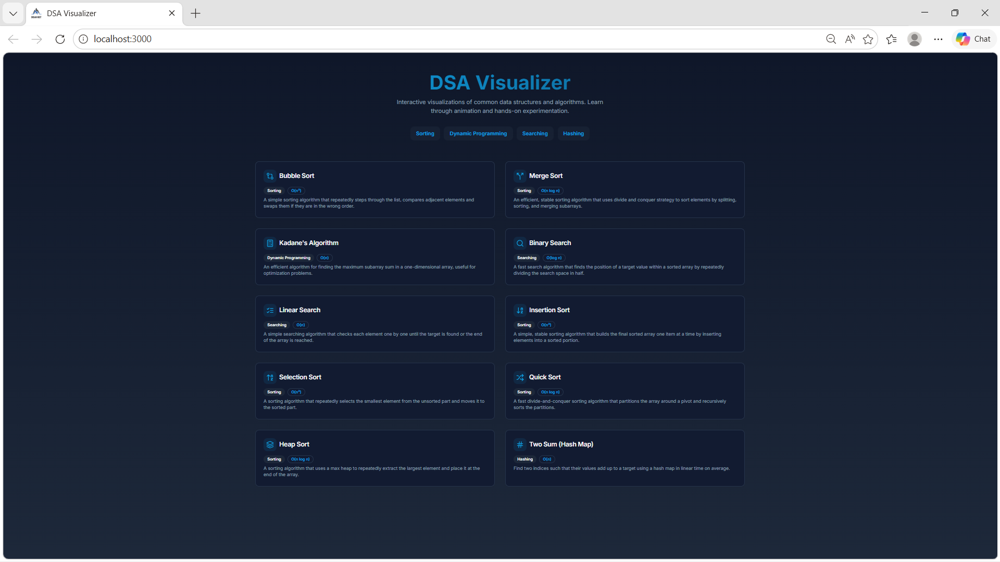
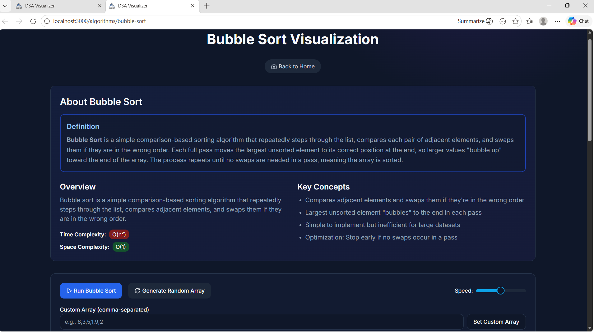
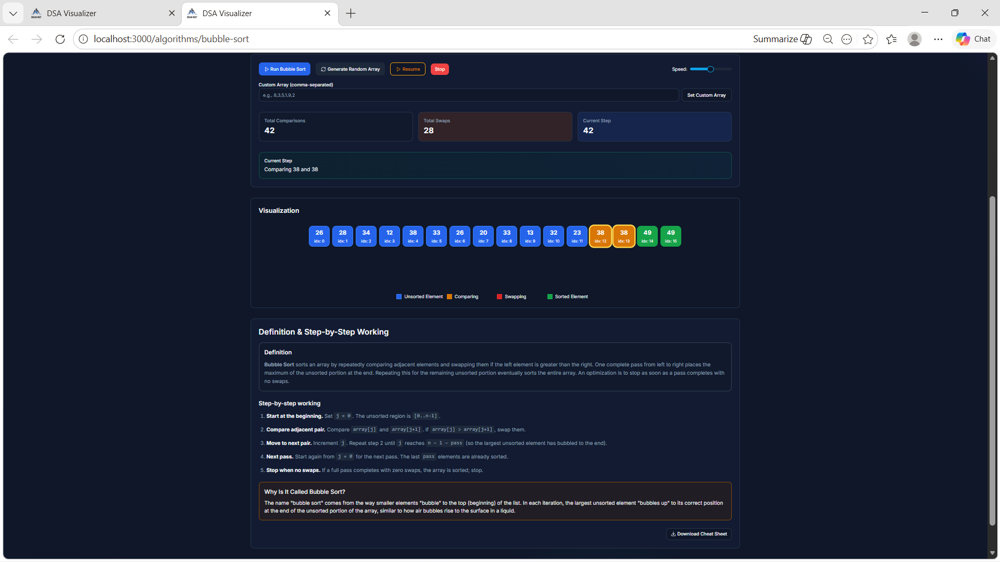
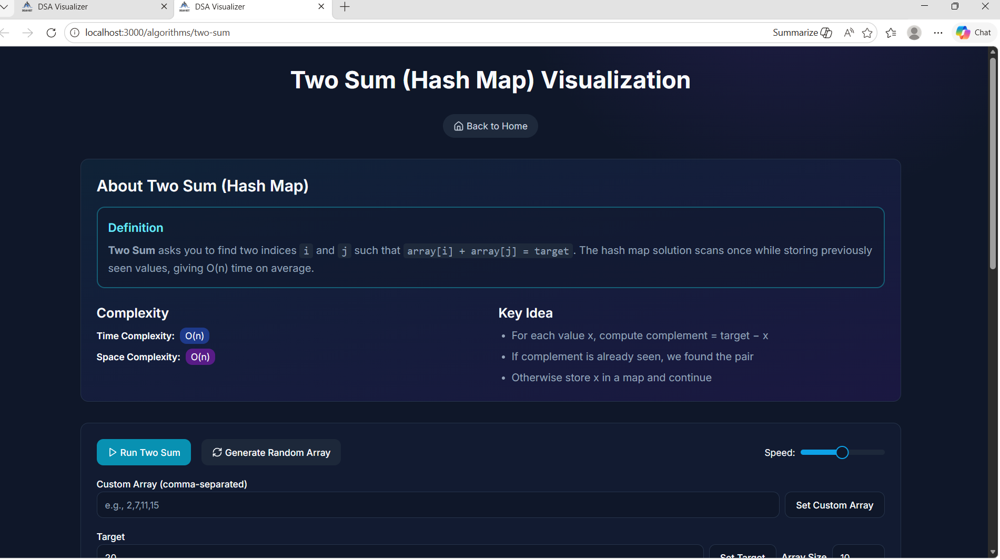
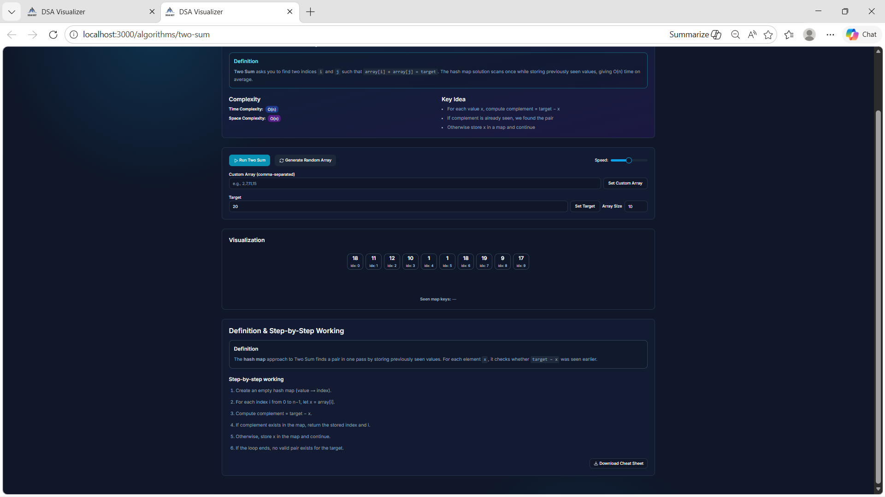

# 🚀 DSA Visualization

An interactive **Data Structures and Algorithms Visualization** project built using **Next.js**, **TypeScript**, and **Tailwind CSS**.  
This project helps users understand how different algorithms work through real-time visual animations.

---

# 📌 Features

## 🔍 Searching Algorithms
- Linear Search
- Binary Search

## 📊 Sorting Algorithms
- Bubble Sort
- Selection Sort
- Insertion Sort
- Merge Sort
- Quick Sort
- Heap Sort

## ⚡ Array Algorithms
- Kadane’s Algorithm (Maximum Subarray Sum)

---

# 🎨 UI Features
- Interactive animations
- Responsive design
- Dark mode UI
- Adjustable animation speed
- Clean and modern interface

---

# 🛠️ Tech Stack

- **Next.js**
- **React**
- **TypeScript**
- **Tailwind CSS**
- **CSS Animations**

---
# 📸 Project Screenshots

## 🏠 Home Page



---

## 🔵 Bubble Sort Visualization



---

## 🟣 Merge Sort Visualization



---

## 🟢 Binary Search Visualization



---

## 🔴 Quick Sort Visualization



# 📂 Folder Structure

```bash
DSA-Visualization/
│── app/
│── components/
│── hooks/
│── images/
│── lib/
│── styles/
│── package.json
│── tsconfig.json
│── tailwind.config.ts
│── README.md
